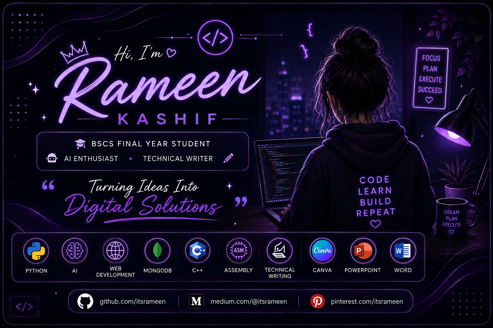

  

  

---

## 👩‍💻 About Me

🎓 Final Year BSCS Student.

🤖 AI learner interested in building practical projects.

📝 I enjoy technical writing, documentation, and creating professional presentations.

🌱 Always learning, exploring, and improving my skills.

  

## 💻 Technical Skills

### 🐍 Programming & AI

  
  
  

### 🌐 Web & Database

  
  

### ⚙️ Other Technical Skills

  

  

## 🛠️ Tools & Productivity

  

## ✍️ Technical Writing

📝 I enjoy writing technical articles, project documentation, and sharing what I learn.

📚 I write about programming, Artificial Intelligence, projects, and my learning journey as a BSCS student.

🌐 I share my articles and technical experiences on **Medium.**

---

  

## 🌱 What I'm Learning

🤖 Artificial Intelligence & Machine Learning  
🐍 Improving my Python skills  
🌐 Exploring Web Development  
💻 Learning Git & GitHub  
📚 Building better projects and documentation

---
## 🌐 Connect With Me

---

## ✨ Motto

> **Learn • Build • Create • Grow 🚀**

  

